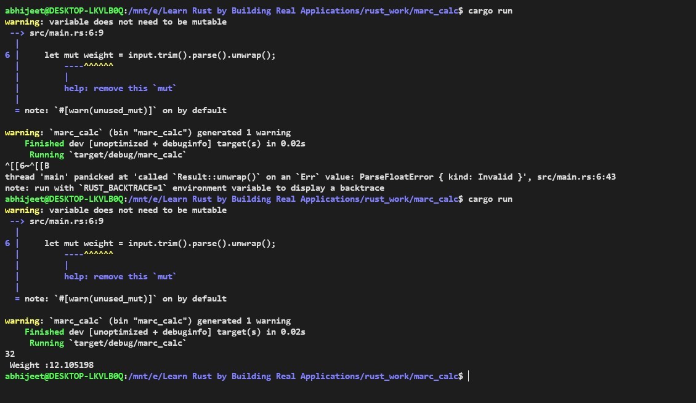
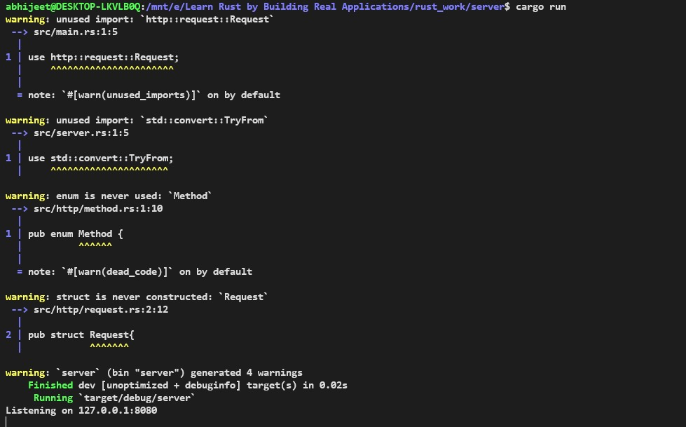

## Resources
1 (https://www.udemy.com/course/rust-fundamentals/) :
2  https://doc.rust-lang.org/book/

## Objectives Learned :

1) Ownership    
2) Stack and Heap
3) Heaps
4) Data Types

## Application Made:

1) Command Line Application to Find Weight on Mars (Completed)

2) HTTP server(In Progress!)